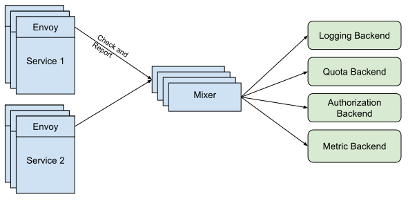
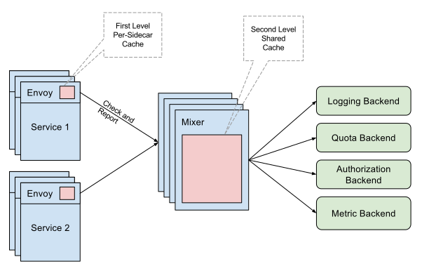

# 概述

Istio提供灵活的模型来执行授权策略，并为网格中的服务收集遥测数据。

基础设施后端旨在提供用于构建服务的支持功能。它们包括访问控制系统，遥测捕获系统，配额执行系统，计费系统等等。服务传统上直接与这些后端系统集成，创建硬耦合，还有沾染特定的语义和使用选项。

Istio提供统一抽象，使得Istio可以与一组开放式基础设施后端进行交互。这样做是为了给运维提供丰富而深入的控制，同时不给服务开发人员带来负担。Istio旨在改变层与层之间的边界，以减少系统复杂性，消除服务代码中的策略逻辑并将控制权交给运维。

Mixer是负责提供策略控制和遥测收集的Istio组件：

在高层上，Mixer提供：

- **后端抽象**。 Mixer隔离Istio的其余部分和各个基础设施后端的实现细节。
- **中介**。 Mixer允许运维对网格和基础设施后端之间的所有交互进行细化控制。

除了这些纯粹的功能方面，Mixer还具有如下所述的可靠性和可扩展性优势。

策略执行和遥测收集完全由配置驱动。可以完全禁用这些功能，并免除在Istio部署中运行Mixer组件的必要性。

## Adapter

Mixer是高度模块化和可扩展的组件。他的一个关键功能就是把不同后端的策略和遥测收集系统的细节抽象出来，使得Istio的其余部分对这些后端不知情。

Mixer处理不同基础设施后端的灵活性是通过使用通用插件模型实现的。每个插件都被称为*Adapter*，Mixer通过它们与不同的基础设施后端连接，这些后端可提供核心功能，例如日志、监控、配额、ACL检查等。通过配置能够决定在运行时使用的确切的适配器套件，并且可以轻松扩展到新的或定制的基础设施后端。

## 可靠性和延迟

Mixer是一种高度可用的组件，其设计有助于提高整体可用性并减少网格中服务的平均延迟。其设计的关键方面带来以下好处：

- **无状态**。 Mixer是无状态的，因为它不管理任何自己的持久化存储。

- **硬化**。Mixer本身被设计成高度可靠的组件。设计目标是为任何单独的Mixer实例实现> 99.999％的正常运行时间。

- **缓存和缓冲**。 Mixer被设计为累积大量瞬态短暂状态。

位于网格中每个服务实例旁边的sidecar代理必须在内存消耗方面节约，这限制了本地缓存和缓冲的可能数量。然而，Mixer独立运行，可以使用相当大的缓存和输出缓冲区。因此，Mixer可用作Sidecar的高度扩展且高度可用的二级缓存。

由于Mixer的预期可用性远高于大多数基础设施后端（通常这些可用性可能达到99.9％）。Mixer的本地缓存和缓冲不仅有助于减少延迟，而且即使在后端无响应时也能继续运行，从而有助于屏蔽基础设施后端故障。

最后，Mixer的缓存和缓冲有助于减少对后端的调用频率，并且有时可以减少发送到后端的数据量（通过本地聚合）。这些都可以减少某些情况下的运维费用。

