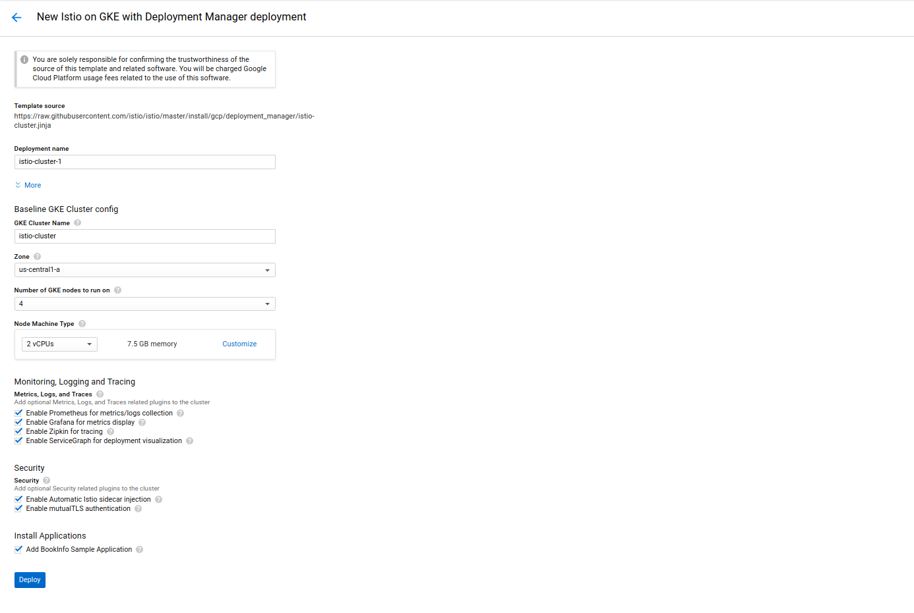
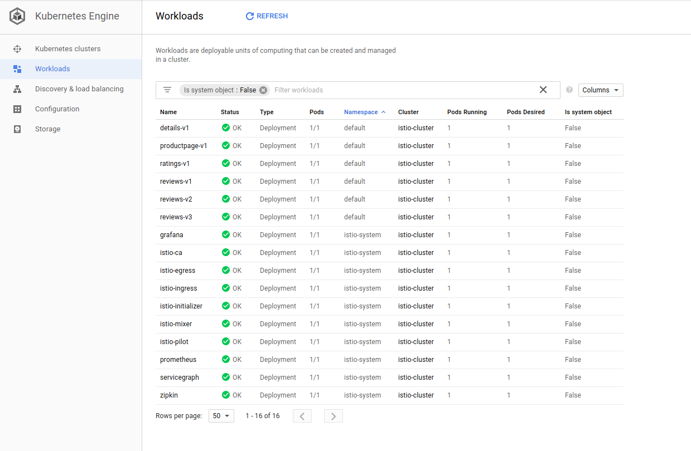
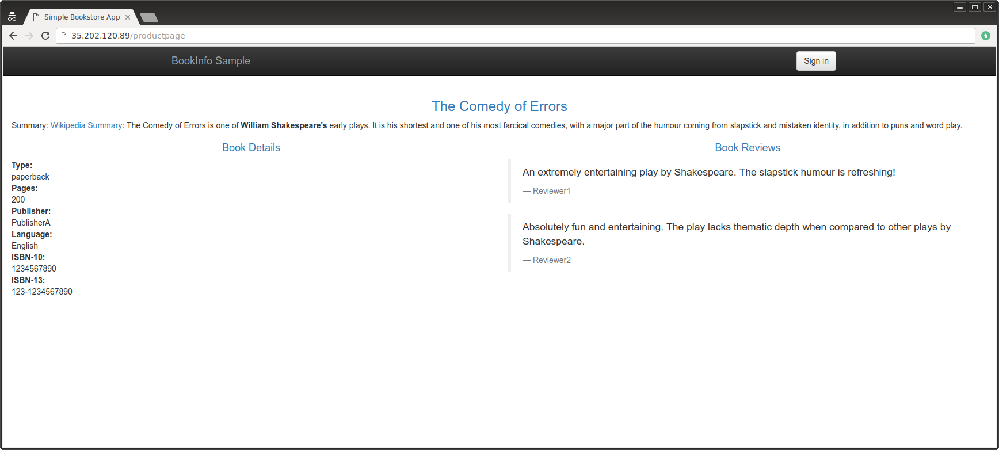
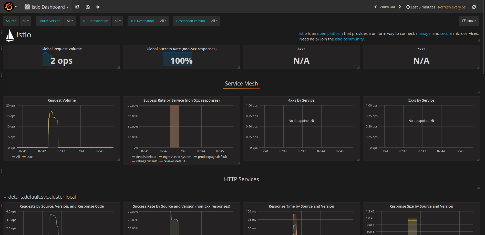
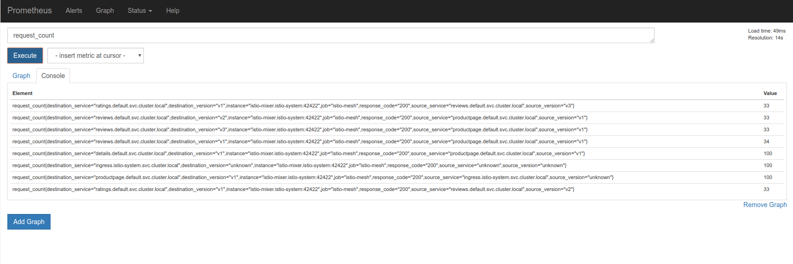
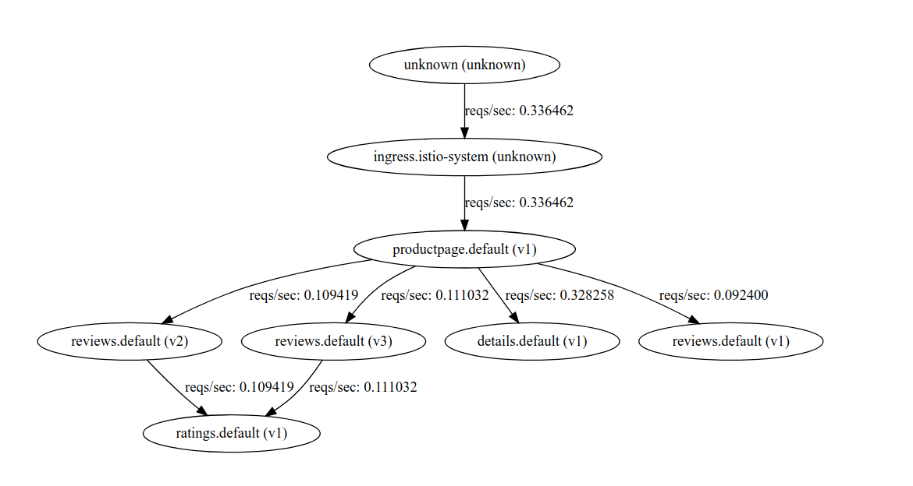
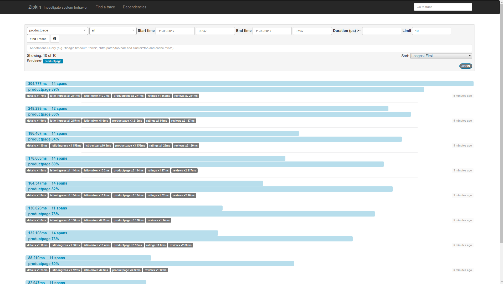

# 使用谷歌 Kubernetes 引擎快速开始

快速开始操作指南，使用[谷歌云开发管理工具](https://cloud.google.com/deployment-manager/)，在[谷歌 Kubernates 引擎](https://cloud.google.com/kubernetes-engine/)（GKE）上安装和运行 Istio。

这个快速开始创建了一个新的 GKE 簇，安装 Istio 并部署 [BookInfo](../../guides/bookinfo.md) 样例应用。[在 Kubernates 创建 Istio 指南](quick-start.md)的基础上，使用调度管理工具为 Kubernates 引擎提供一个自动的细化步骤。


> 提示: 默认安装将会创建一个 GKE [alpha 簇](https://cloud.google.com/kubernetes-engine/docs/alpha-clusters)，允许[自动化 sidecar 注入](sidecar-injection.md)。由于是一个 Alpha 的簇，所以他并不支持 自动化节点或者主更新，而且将会在30天后自动删除。


## 前置条件

* 本样例需要一个有效的，并且打开了账单的谷歌云平台项目。如果你不是一个已经存在的 GCP 用户，你可以注册登记成为一个300美金的[试用](https://cloud.google.com/free/)账户。

* 确认为你项目打开了[谷歌容器引擎接口](https://console.cloud.google.com/apis/library/container.googleapis.com/)（并能通过导航条中的 “APIs & Services” -> "Dashboard" 找到）。如果你不能看到 “API enable”，那么你可能需要点击“Enable this API”按钮来开启接口。

* 你必须安装和配置 [gcloud 命令行工具](https://cloud.google.com/sdk/docs/)并包含 <font color=red>kubectl</font> 组件（<font color=red>gcloud 组件安装 kubectl</font>）。如果你不想在你的电脑上安装 <font color=red>gcloud</font> 客户端，你可以通过 [Google Cloud Shell](https://cloud.google.com/shell/docs/) 使用 <font color=red>gcloud</font> 来运行同样的任务。

*  你必须设置你的默认计算服务账户包括一下方面：

>
* <font color=red>roles/container.admin</font> (Kubernetes 引擎管理员)
* <font color=red>Editor</font> (默认)

设置这些，在 [Cloud 控制台](https://console.cloud.google.com/iam-admin/iam/project) 上导航到 **IAM** 章节，默认从下文的 ：<font color=red>projectNumber-compute@developer.gserviceaccount.com</font>：找到默认的 GCE/GKE 服务账户，应该拥有**编辑者**的角色。然后在这个账户的**角色**下拉列表中，找到 **Kubernates 引擎**组，选择 **Kubernates 引擎管理员**。你账户中的**角色**列表将会变成**多个**。

## 安装

### 装载调度管理工具

1. 一旦你的账户和项目启用，点击下文的链接，打开部署管理。

> * [Istio GKE 部署管理](https://accounts.google.com/signin/v2/identifier?service=cloudconsole&continue=https://console.cloud.google.com/launcher/config?templateurl=https://raw.githubusercontent.com/istio/istio/master/install/gcp/deployment_manager/istio-cluster.jinja&followup=https://console.cloud.google.com/launcher/config?templateurl=https://raw.githubusercontent.com/istio/istio/master/install/gcp/deployment_manager/istio-cluster.jinja&flowName=GlifWebSignIn&flowEntry=ServiceLogin)

我们建议你就像其他教程中表示的怎样访问已经安装的功能那样，保留默认设置。工具会默认创建一个特殊设置的 GKE Alpha 簇，然后安装在 Istio [控制面板](../../concepts/what-is-istio/overview.md)，[BookInfo](../../guides/bookinfo.md) 样例应用，[Grafana](../../tasks/telemetry/using-istio-dashboard.md) with [Prometheus](../../tasks/telemetry/querying-metrics.md)，[ServiceGraph](../../tasks/telemetry/servicegraph.md) 和 [Zipkin](../../tasks/telemetry/distributed-tracing.md)。你将会找到更多关于怎样访问所有这些如下功能。

2. 点击部署:



<center>*GKE-Istio Launcher*</center>

等Istio完全部署好。注意这会消耗5分钟左右。

### 引导 gcloud

部署完成后，在你安装好的 <font color=red>gcloud</font> 的工作站里，完成以下内容：

1.为你刚刚创建的簇引导 kubectl，并确认簇在运行中，并且 istio 是打开状态。

```bash
gcloud container clusters list
```

```bash
NAME           ZONE           MASTER_VERSION                    MASTER_IP       MACHINE_TYPE   NODE_VERSION  NUM_NODES  STATUS
istio-cluster  us-central1-a  1.7.8-gke.0 ALPHA (29 days left)  130.211.216.64  n1-standard-2  1.7.8-gke.0   3          RUNNING
```

在这里，这个簇的名字是 <font color=red>istio-cluster</font>

2.现在为簇获取资格

```bash
gcloud container clusters get-credentials istio-cluster --zone=us-central1-a
```


## 验证安装

验证 Istio 已经安装在它自己的 namespace 中

```bash
kubectl get deployments,ing -n istio-system
```

```bash
NAME                       DESIRED   CURRENT   UP-TO-DATE   AVAILABLE   AGE
deploy/grafana             1         1         1            1           3m
deploy/istio-ca            1         1         1            1           3m
deploy/istio-ingress       1         1         1            1           3m
deploy/istio-initializer   1         1         1            1           3m
deploy/istio-mixer         1         1         1            1           3m
deploy/istio-pilot         1         1         1            1           3m
deploy/prometheus          1         1         1            1           3m
deploy/servicegraph        1         1         1            1           3m
deploy/zipkin              1         1         1            1           3m
```

现在确认 BookInfo 样例应用也已经安装好：

```bash
kubectl get deployments,ing
```

```bash
NAME                    DESIRED   CURRENT   UP-TO-DATE   AVAILABLE   AGE
deploy/details-v1       1         1         1            1           3m
deploy/productpage-v1   1         1         1            1           3m
deploy/ratings-v1       1         1         1            1           3m
deploy/reviews-v1       1         1         1            1           3m
deploy/reviews-v2       1         1         1            1           3m
deploy/reviews-v3       1         1         1            1           3m

NAME          HOSTS     ADDRESS         PORTS     AGE
ing/gateway   *         35.202.120.89   80        3m
```


记下已经给BookInfo product 也没指定好的 IP 和 Port。（例子中是 <font color=red>35.202.120.89:80</font>） 

你也可以在云控制台上**Kubernetes Engine -> Workloads**章节看到装置：



<center>*GKE-Workloads*</center>


### 访问 BookInfo 样例

1.为 BookInfo 的外网IP创建一个环境变量：

```bash
kubectl get ingress -o wide
```

```bash
export GATEWAY_URL=35.202.120.89
```

2.验证你可以访问 BookInfo <font color=red>`http://${GATEWAY_URL}/productpage`</font>:



<center>*BookInfo*</center>

3.现在给它发送一些信息：

```bash
for i in {1..100}; do curl -o /dev/null -s -w "%{http_code}\n" http://${GATEWAY_URL}/productpage; done
```

## 验证已经安装的 Istio 插件

当你验证了 Istio 控制面板和样例应用正在工作后，尝试访问已经安装好的 Istio 插件。

如果你使用 Cloud Shell 而不是已经安装好的 <font color=red>gcloud</font> 客户端，你使用 [Web Preview](https://cloud.google.com/shell/docs/using-web-preview#previewing_the_application) 功能将包转发和代理。比如，从 Cloud Shell 访问 Grafana，改变 kubectl 端口映射从 3000:3000 到 8080:3000。你可以通过 Web Preview 代理在 8080 到 8084 这个范围里，同时预览其他4个控制台。

### Grafana

建立一个 Grafana 通道：

```bash
kubectl -n istio-system port-forward $(kubectl -n istio-system get pod -l app=grafana -o jsonpath='{.items[0].metadata.name}') 3000:3000 &
```

然后

```bash
http://localhost:3000/dashboard/db/istio-dashboard
```

你应该看到一些关于你早期发送的请求统计信息。



<center>*Grafana*</center>

想通过 Grafana 看到更多细节，点击 [关于Grafana附加](../../tasks/telemetry/using-istio-dashboard.md)

### Prometheus

Prometheus 跟着 Grafana 一起安装。你可以使用控制台看到如下的 Istio 和 应用矩阵：

```bash
kubectl -n istio-system port-forward $(kubectl -n istio-system get pod -l app=prometheus -o jsonpath='{.items[0].metadata.name}') 9090:9090 &
```

看控制台如下：

```bash
http://localhost:9090/graph
```



<center>*Prometheus*</center>

更多细节，点击[关于Prometheus附加](../../tasks/telemetry/querying-metrics.md)。

### ServiceGraph

建立一个 ServiceGraph 通道：

```bash
kubectl -n istio-system port-forward $(kubectl -n istio-system get pod -l app=servicegraph -o jsonpath='{.items[0].metadata.name}') 8088:8088 &
```

你应该看到 BookInfo 服务拓扑如下

```bash
http://localhost:8088/dotviz
```



<center>*ServiceGraph*</center>


更多细节，点击[关于ServiceGraph附加](../../tasks/telemetry/servicegraph.md)。

## 追踪

建立一个 Zipkin 通道：

```bash
kubectl port-forward -n istio-system $(kubectl get pod -n istio-system -l app=zipkin -o jsonpath='{.items[0].metadata.name}') 9411:9411 &
```

你能看到早期的追踪统计：

```bash
http://localhost:9411
```



<center>*Zipkin*</center>

更多追踪细节，点击[理解发生了什么](../../tasks/telemetry/distributed-tracing.md)。

## 下一步

你可以通过[指南](../../guides/index.md)里的任一指导，更深一步的探索 BookInfo 应用和 Istio 功能性。然而，你需要安装 <font color=red>istioctl</font> 来与 Istio 进行交互。你可以在我们的工作站或者Cloud Shell来直接的[安装](quick-start.md)它。

## 卸载

1. 在云控制台 [https://console.cloud.google.com/deployments](https://console.cloud.google.com/deployments) 导航到调度章节 
 
2. 选择部署并点击**删除**. 

3. 调度管理工具将会删除所有已经部署的 GKE 构件 - 然而，元素例如 Ingress 和 LoadBalancers 将会保留。你可以通过云平台的 [Network Services -> LoadBalancers](https://console.cloud.google.com/net-services/loadbalancing/loadBalancers/list) 来删除这些构件。


